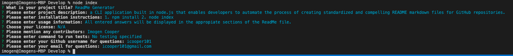

  # ReadMe Generator :dark_sunglasses:
  
[]!(./src/javascript.svg)(https://aleen42.github.io/badges/src/javascript.svg)
  # Description
  A CLI application built in node.js that enables developers to automate the process of creating standardized and compelling README markdown files for GitHub repositories.
  
  # Table of Contents
  * [Installation]()
  * [Usage]()
  * [License]()
  * [Contributing]()
  * [Test]()
  * [Questions]()
  
  # Installation 
  This application will be initiated in the VSC terminal with the following command:

   1. npm install 2. node index

  # Usage  
  All entered answers will be displayed in the appropiate sections of the ReadMe file.
  

  # License  
  N/A

  # Contributing  
  Imogen Cooper

  # Test
  no testing specified
  # Questions
  If you have any questions, reach me via Github: icooper101
  or send me an email at: icooper101@gmail.com
